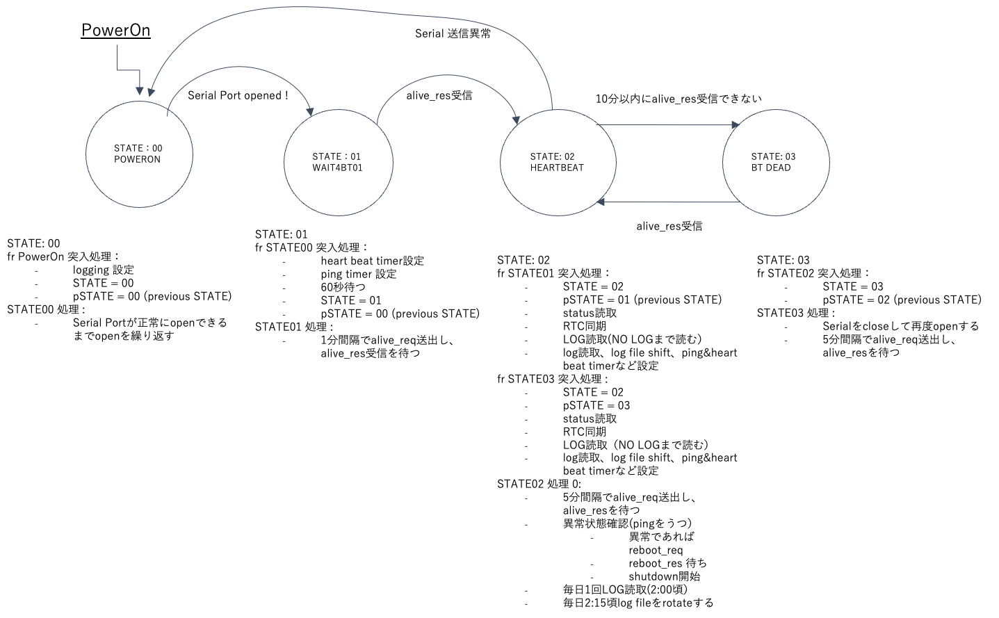

# ARMM (Auto Recovery Monitoring Module)

まず、ARMMの概要を述べ、次に通信プログラムの説明と導入手順を説明します。

## ARMM概要

ARMMは32ビットMCUを内蔵した超小型ボードで、EDGEMATRIX Inc.が開発しました。Edge AI BOX内のJetson moduleとシリアル通信を介してheat beatや各種コマンドのやりとりを行います。またEdge AI BOXの主電源をON/OFFできる機能を持っており、Edge AI BOXの異常を検出した場合に主電源を入れ直すことで異常状態からの回復を試みることが可能です。

ARMMには外付け型と内蔵型の2種類があります。ARMMの詳細は別資料を参照してください。

ここには2種類のプログラムがあります。
 - bt-01フォルダ および bt-11フォルダにあるホスト側サンプルプログラム
 - TestCommandsフォルダにあるシリアル通信コマンド試験用プログラム

以下に各々を説明します。

## サンプルプログラム説明
Edge AI BOXを監視し、ARMMとシリアル通信を行う、Edge AI BOXにて実行するサンプルプログラムになります。

以下の状態線図は本サンプルプログラムの状態線図になります。
この状態遷移はBT-SerialCommunication.pyにて使用しています。

本フォルダにはサンプルプログラムとして bt-01フォルダ と bt-11フォルダがあります。
bt-01フォルダは Jetpack4.4 Python3.6 にて動作確認した”外付け”ARMM用ファイルになります。
bt-11フォルダは Jetpack5.1.1 Python3.8　にて動作確認した"内蔵”ARMM用ファイルです。

基本的に機能が同等のファイルが収められていますが、デバイス名(/dev/tty）やフォルダ名(bt-XX)が異なります。各ファイルの概要を以下に説明します。

- README.md
  - 内容説明
- BT-SerialCommunication.py
  - ホスト側サンプルプログラム。状態遷移図に従って、インターネット通信を監視し、ARMMとシリアル通信を行います。インターネット通信は5分毎に異なる２サーバーをpingしますが、どちらかでもpingが帰らない状況が2回続くとARMMに電源の入れ直し(cold boot)を要求します。また、5分毎にARMMと通信(heart beat)を行います。Edge AI BOXが異常を起こしheart beatが2回連続して停止するのをARMMが捉えると電源の入れ直し(cold boot)を行います。
- start_bt.service
  - 自動起動用サービス起動ファイル
- start_bt.sh
  - 自動起動用BT-SerialCommunication.py起動シェルスクリプト
- send_bt-logs.sh
  - logファイル全てをmailで送るシェルスクリプト
- sendlog.py
  - logファイル全てをmailで送るプログラム
- bt_id.txt
  - 本プログラムがどのEdge AI Boxに組み込まれたのかを識別するIDファイル。ユーザーが自由に内容を設定できます。

### Edge AI Box への導入手順
- bt-01フォルダ内、およびbt-11フォルダ内のREADME.mdにも同様の説明があります。
- Edge AI BOXに nvidia でlogin します。
- pipをインストールします。
  - sudo apt install -y python3-pip
  - python3 -m pip install --upgrade pip
- schedule and pyserialをインストールします。
  - python3 -m pip install schedule pyserial
- dialoutグループにnvidiaを追加します。
  - id -a   （dialoutにnvidiaが含まれていないことを確認）
  - sudo gpasswd -a nvidia dialout
  - reboot
- nvidiaでloginし、dialoutに追加できたか確認する
  - id -a

- BT-SerialCommunication.py, start_bt.service, start_bt.shを~/bt-XX/下にコピーします。
  - scp例
    - 例えば自分のPCのフォルダに移動してscpコマンドを実行する。
      - scp BT-SerialCommunication.py nvidia@xxx.xxx.xxx.xxx:/home/nvidia/bt-XX
- python3 BT-SerialCommunication.py で試験。　まだservice 起動していない
- 動作に問題ないようであれば自動起動設定
  - chmod u+x start_bt.shで実行できる様にする。（不要かもしれませんが）
  - /etc/systemd/systemの下にサービスファイルをコピーし、次に以下のコマンドを実行する。
    - sudo systemctl enable start_bt.service
    - sudo systemctl start start_bt.service     （試しに起動してみる）
    - sudo systemctl status start_bt.service　　 （動作確認）
    - rebootで起動するか確認
    - reboot　　して立ち上がってから、
    - sudo systemctl status start_bt.service      （動作確認）
- 以上で正常動作すればbt-XXにlogファイル(BT-log)が作られます。BTーlogは毎日早朝２時頃bt-log.1~7にてローテーションするようにセーブされます。
#### 以下は、logファイル(BT-log, BT-log.1,...,BT-log.7)をメールで読み出すための設定になります。
- send_bt_logs.sh, sendlog.py, bt_id.txtを~/bt-XX/下にscpなどでコピーします。
- bt_id.txtは対象機(ARMMと通信し合うEdge AI Box)のidとなりますので、各対象機でユニークなidとなるようにファイル内容を変更してください。フォーマットは自由です。
- chmod u+x send_bt-logs.sh を ~/bt-XX で実行します。
- sendlog.pyは基本的にgoogle mailを使用するようになっており、メールアドレスとloginするためのアプリケーションパスワードを準備しなければなりません。これらはユーザーにて準備をお願いします。
- メールで読み出すためのコマンドは、$./send_bt-logs.sh from@fromsample.com from-appPassword to@tosample.com になります。
  - from@fromsample.com : メールの送信元。このsmtpサーバーを使用します。このメールアドレスはgoogle mailを前提としています。
  - from-appPassword : 上記smtpサーバー(smtp.google.com)のアプリケーションパスワード。
  - to@tosample.com : メールの送信先。
  - /home/nvidia/bt-01 に移動して本コマンドを実行します。
  - 実行例：$./send_bt-logs.sh tx@sample1.com 1111222233334444 rx@sample2.com

## 試験プログラム
Python tkinter を用いたGUIベースのARMMシリアルコマンドを試験するプログラムです。事前にtkinter, pyserial(serial)などをinstallします。main.pyを実行する(例 $python3 main.py)と起動します。ただし、ARMMの電源が入って、シリアル通信準備(/dev/ttyがopen)ができるまで、プログラムが待ちますので注意が必要です。

コマンドは内蔵型ARMMで使用するコマンドを全て網羅しています。外付け型ARMMはサブセットなので外付け型にも使えます。

本プログラムは、MacbookAirと外付け型ARMM(bt-01)をシリアルケーブルで接続して試験しました。EDGEMATRIX社のEX5での利用では、/dev/ttyTHS0を使って内蔵型ARMM(bt-11)とシリアル通信しますので、console_UI.py内の/dev/tty記述を変更します。

各プログラムについて説明します。

- main.py
  - mainプログラム。これを実行します。
- console_UI.py
  - GUI表示とボタン押下時の動作などを行うクラス
- btSerial.py
  - シリアル通信クラス

End Of Doc 2023/08/30
